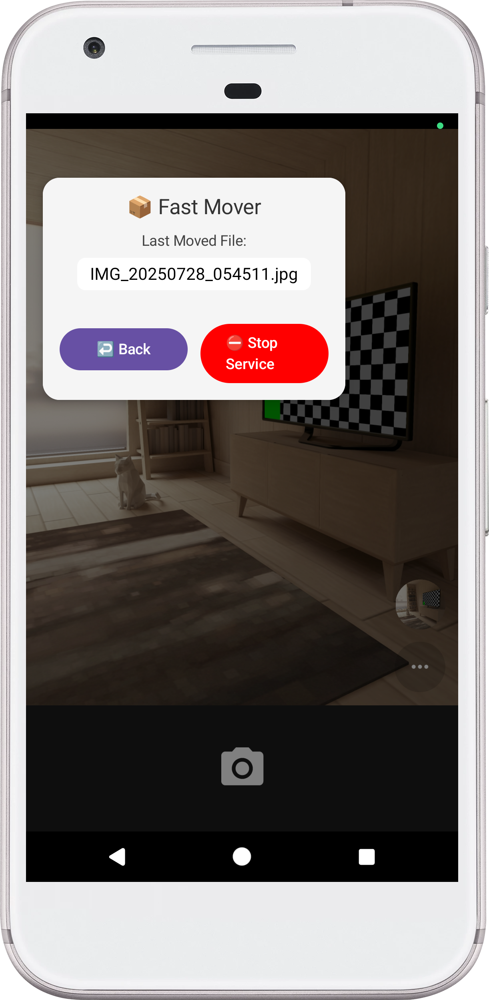

# 📂 Fast Mover – Android Floating File Transfer Tool

Fast Mover is a lightweight Android utility that automatically transfers files between two folders. It features a floating bubble UI powered by a foreground service, watching for newly added files in the source folder and moving them to the destination folder using SAF-based URIs.

## 🚀 Features

- 📌 Modern UI built with **Jetpack Compose**
- 📂  Folder selection via **SAF (Storage Access Framework)**
- 📤  Automatically moves new files from source to destination
- 🫧 **Floating Bubble** UI for interactio
- 🔔 Displays the last moved file name on the bubble
- 🛑 When the application is closed or restarted or URL registration

## 🖼️ Use

[//]: # (![Fast Mover Gif](./screenshots/fast-mover.gif))

<!-- 
<table>
  <tr>
    <td align="center">
      🗑️ <strong>Main Screen</strong> 
       
    </td>
    <td align="center">
      ✅ <strong>Folder Choose Via </strong> 
       
    </td>
  </tr>
  <tr>
    <td align="center">
      📂 <strong>Showing Last Moved File on Bubble</strong> 
       
    </td>
  </tr>
</table>
-->

## ⚙️ How It Works

1. Launch the app and select source & destination folders.
2. Grant necessary permissions (overlay, all-files-access).
3. Start the bubble service.
4. When a new file appears in the source folder, it is automatically moved to the destination.
5. The bubble shows the name of the last transferred file.

## 📁 URI Access

This app uses `DocumentFile` and `ContentResolver` for all file operations based on `Uri`. This ensures safe access across all Android versions.

## 🔐 Permissions

- `MANAGE_EXTERNAL_STORAGE` (Android 11+)
- `SYSTEM_ALERT_WINDOW` (for overlay)
- `FOREGROUND_SERVICE`

## 💡 Technical Notes

- Existing files in the source folder are ignored when the service starts.
- Only files added while the service is active are considered.
- User can't choose some folder because of SAF limitations caused by Android policies. (Root, Downloads etc.)
- The floating bubble interface is adapted from the [Floating Bubble View](https://github.com/dofire/Floating-Bubble-View)

---

© 2025 Enes Topal. MIT License.
